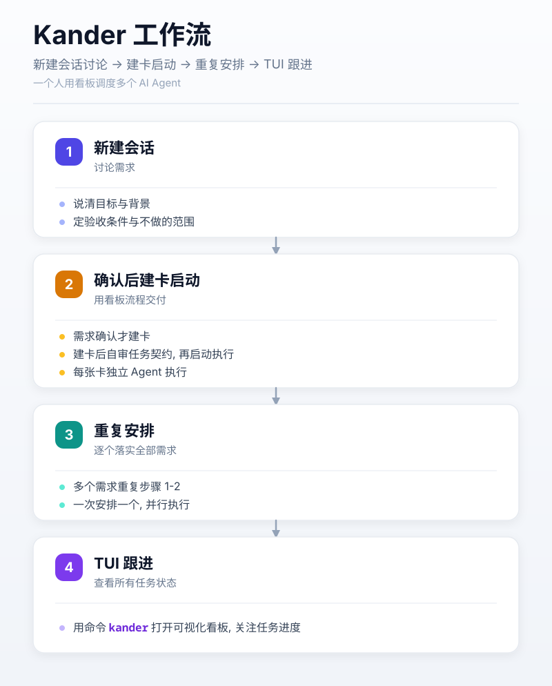

# Kander

[English](README.md) | **简体中文** | [日本語](README-JA.md)

[](https://github.com/dualface/kander)

强规则驱动的多 Agent 并行开发，内置独立审查与交付门禁，充分保障自动化交付质量。

> **从真实工程中诞生**
>
> 自 2026 年 8 月以来，Kander 已在 4 个项目中完成了 1,500 多个真实开发任务，其中 1,315 个来自 [QuickTUI](https://quicktui.ai/) 生产环境。在处理实际的代码冲突、并发竞争和复杂缺陷时，不断优化提炼，最终沉淀出了一套真正可靠的 Agent 调度、独立审查与崩溃恢复机制。即便使用更廉价的模型，也能保证交付质量。
>
> | 1 人 + 6 个 Agent       | 68 天                 | 4 个项目                 |
> | ----------------------- | --------------------- | ------------------------ |
> | 完成 **1,544** 张任务卡 | 独立审核 **1,484** 次 | **50%** 的审核批次被拦下 |
>
> 数据与口径：[Kander 实战数据](docs/production-stats-cn.md)（统计至 2026-10-07）
>
> 深入阅读：[Kander 生产实践回顾](docs/KANDER_PRODUCTION_RETROSPECTIVE_CN.md) ｜ [完整分析报告（英文深度分析）](docs/KANDER_PRODUCTION_RETROSPECTIVE_FULL_EN.md)



### 核心特性

- **两阶段独立审查门禁**：执行与代码审查物理隔离。PMQA 关注功能逻辑与隐性缺陷，拦截假绿测试。
- **冲突感知调度**：静态分析 Git 分支重叠与文件修改边界，受控并发，杜绝文件写冲突。
- **终端与工作区隔离**：基于 Git Worktree 和 tmux/herdr 容器，多 Agent 并行执行互不干扰。
- **无感 GitHub 集成**：复用本机 `gh` 凭据，看板内直接浏览 Issue、一键导入任务卡、同步进度。

## 1. 快速开始

运行需要 Git，以及 Codex、Claude、Grok、Cursor 或 Pi 中至少一个。

**macOS** — 使用 Homebrew 安装：

```sh
brew install dualface/tap/kander

kander
```

**Linux** — 直接下载二进制：

```sh
ARCH=$(uname -m); [ "$ARCH" = x86_64 ] && ARCH=amd64; [ "$ARCH" = aarch64 ] && ARCH=arm64
curl -fsSL "https://github.com/dualface/kander/releases/latest/download/kander-linux-${ARCH}.tar.gz" | tar xz

./kander
```

**Windows** — 从 [Releases](https://github.com/dualface/kander/releases) 下载 `kander-windows-amd64.zip`，解压后运行 `kander.exe`。

首次启动若尚未安装，会进入交互向导。安装完成后即可使用。

4 步上手：

1. 新建一个 Agent 会话，在里面讨论需求或任务，明确目标与验收条件。推荐使用 Agent 的 Plan 模式。
2. 任务确认后，Agent（安装 Kander 规则后）会确认是否通过看板流程启动任务，确认后自动创建并启动。
3. 有多个需求时，对每个需求重复步骤 1-2，持续编排并启动任务。
4. 用命令行界面查看任务状态：

```sh
kander
```


> 上图看板内容来自我的真实项目 [https://quicktui.ai](https://quicktui.ai/)。QuickTUI 是一个远程操作电脑上各种 Agent 的工具，支持 iOS/Android/macOS/Linux/Windows，免费使用。

### 终端看板快捷键

| 按键              | 说明                                      |
| ----------------- | ----------------------------------------- |
| `Space` / `Enter` | 查看任务详情，支持 Vim 模式浏览           |
| `m`               | 任务操作菜单（启动、移动、归档）          |
| `g`               | 打开 GitHub Issues 浮层（查看与一键导入） |
| `c`               | 调起独立 Chat 会话（即时讨论，不占卡片）  |
| `y`               | 复制选中卡片的任务 ID                     |
| `/`               | 过滤/搜索卡片                             |
| `r`               | 手动刷新看板数据                          |

进阶阅读：[如何高效推进任务](docs/how-to-advance-tasks-efficiently-cn.md) ([PDF 幻灯片](docs/how-to-advance-tasks-efficiently-cn.pdf))。

## 2. 常用命令

- `kander`：打开交互式终端看板。
- `kander doctor`：检查并修复环境依赖、Agent 可用性、启动器与规则配置。

## 3. GitHub 集成

把项目关联到 GitHub 仓库需要 [GitHub CLI](https://cli.github.com/)（`gh`）。Kander 不会索要、读取或保存 token，只复用 `gh` 已管理的凭据。

在终端看板中按 `g` 会以弹窗形式打开 GitHub Issue 列表。

## 4. 常见问题 (FAQ)

#### Q: 如何将任务卡交给不同的 Agent 继续推进？

**A:** 停止正在处理该任务卡的 Agent，启动新的 Agent，然后要求它接手并继续推进任务卡 `TASK-ID`（将 `TASK-ID` 替换为具体任务卡 ID 即可）。在终端看板中选中任务卡按 `y` 键可直接复制任务卡 ID。

#### Q: 如何让 Agent 接手整个任务组？

**A:** 复制任务卡 ID，启动 Agent，要求它作为主控接手并推进任务卡 `TASK-ID` 所在的任务组。

#### Q: 如何搞清楚未完成任务的状态？

**A:** 启动任意已安装 Kander 规则的 Agent，直接询问它未完成任务卡的当前状态与进展即可。

## 5. 搭配 ste-zh，任务汇报一眼看懂

推荐把 Kander 和 [ste-zh](https://github.com/dualface/ste-zh) 一起用。ste-zh 是一个 Agent skill，让 Agent 按 ASD-STE100（简化技术英语）的原则，用中文汇报结果。

作者日常用 Kander 时搭配 ste-zh，任务汇报的效果非常理想。Kander 的完成报告本来就要求如实记录验证结果；ste-zh 让每一条回复都容易读：

- 第一句写结论；
- 状态词固定，例如「已完成」「未验证」「阻塞」；
- 每个结论都写明是否验证，以及怎样验证；
- 需要你决定时，列出编号选项。

多张卡并行跑的时候，每份汇报几秒钟就能读完：哪些完成了，哪些没验证，哪些等你拍板。

Claude Code 安装方式如下（目录名必须是 `ste`）。安装后在会话里输入 `/ste` 开启；也可以写进全局规则，让每个会话默认开启。

```bash
git clone https://github.com/dualface/ste-zh.git ~/.claude/skills/ste
```

## 6. 进阶文档

- [审查机制与完成门禁](docs/review-disposition-cn.md)
- [卡片事务与崩溃恢复](docs/card-transactions-cn.md)
- [终端后端与容器定义](docs/terminal-backend-cn.md)
- [任务持久化派发协议](docs/durable-dispatch-cn.md)
- [GitHub Issue 导入与结果协议](docs/github-issue-import-cn.md)

## 7. 许可

本项目使用 MIT License，见 [LICENSE](LICENSE)。

## 8. 更新日志

发布说明见 [CHANGELOG.md](CHANGELOG.md)。

## 9. 作者的其他项目

以下是 Kander 作者 [dualface](https://github.com/dualface) 的其他项目：

- [ste-zh](https://github.com/dualface/ste-zh)：让 Agent 按 ASD-STE100 原则用中文汇报结果，结论先行、状态词固定、写明是否验证。
- [Ullage](https://github.com/dualface/ullage-cli)：本地守护进程 + CLI，查看 Claude、ChatGPT、Grok、Cursor 等订阅的用量。
- [QuickTUI](https://quicktui.ai/)：手机上的完整终端，适用于任何编码 Agent。自托管直连，单台主机免费。
