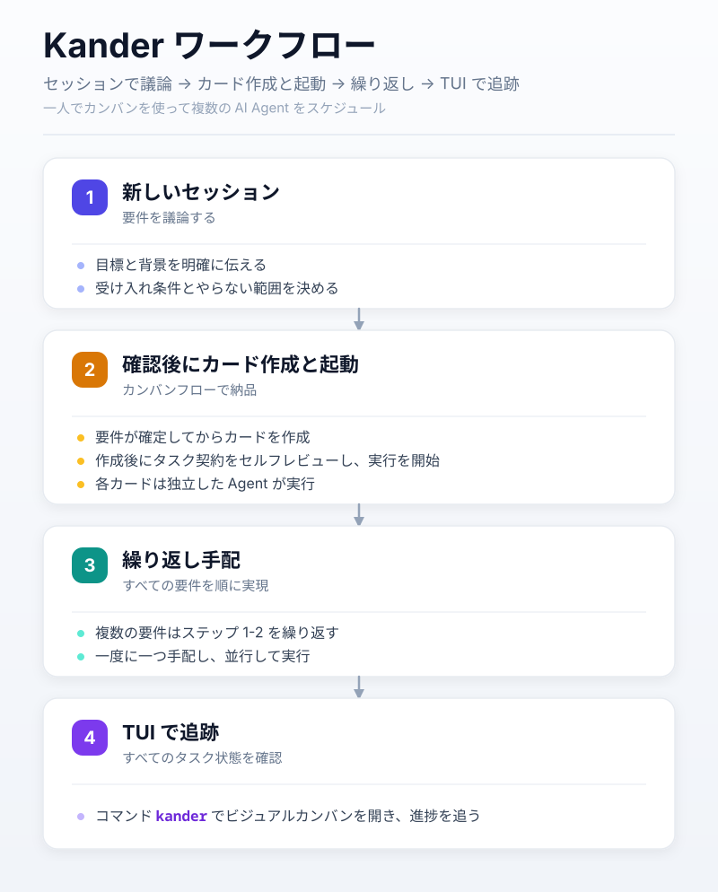
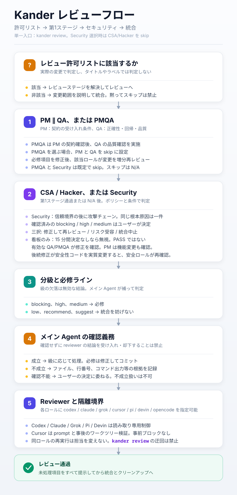

# Kander

[English](README.md) | [简体中文](README-CN.md) | **日本語**

一人でカンバンを使って複数の AI Agent をスケジュールする。



## 1. はじめに

インストールが完了すればすぐに使えます。

4 ステップで始められます:

1. Agent セッションを新規に開き、そこで要件やタスクを議論し、目標と受け入れ条件を明確にします。Agent の Plan モードの利用を推奨します。
2. タスクが確定したら、そのセッション内で Agent にカンバンフローでタスクを完了するよう依頼します:

```text
kander new でカードを作成し、kander start で起動してください
```

3. 要件が複数ある場合は、要件ごとにステップ 1-2 を繰り返し、継続的にタスクを手配・起動します。
4. コマンドラインインターフェースでタスクの状態を確認します:

```sh
kander
```

より詳しい進め方はスライド [タスクを効率的に進める方法](docs/how-to-advance-tasks-efficiently-ja.pdf) (PDF) を参照してください。

## 2. インストール

Go 1.25+、Git、および Codex、Claude、Grok、Cursor のうち少なくとも 1 つが必要です。

kander のバイナリを入手したらそのまま実行できます。初回起動時にまだインストールされていなければ対話ウィザードが始まります: インターフェース言語 (`cn`/`en`/`ja`) とインストール先を選ぶと、ルールを展開し自身をインストール先へコピーします。ルールは英語版のみが存在します。Agent があなたと会話する言語は設定 `agent_language` で決まり、その後に開くオプションパネルで変更できます。カード作成時にはこの値がタスクカードの `LANGUAGE` フィールドに書き込まれ、以降そのカードはずっとその言語を使います。続いて環境チェックとオプションパネルに自動的に進みます。インストール済みのユーザーは `kander install` でウィザードを再実行できます (ルールの更新やインストール先の変更)。コマンドは `--lang ja` で直接日本語インターフェースに切り替えることもできます。

Go でソースからインストール:

```sh
go install github.com/dualface/kander/cmd/kander@latest
```

またはリポジトリルートでビルドして実行:

```sh
make
./kander
```

Windows (make 不要):

```powershell
.\make-windows.cmd
.\kander.exe
```

Kander には 2 つのインストールスコープがあり、同じルールとプログラムを共有します。

インストール、`kander doctor` による修復、オプションパネルの保存時には、ルールのエントリが Agent のルールファイルへ自動的に接続されます: Claude では `CLAUDE.md` (グローバルは `~/.claude/CLAUDE.md`、プロジェクトはリポジトリルート) に `@` 参照行を追記し、その他の Agent では対応する `AGENTS.md` (グローバルは `~/.codex/`、`~/.cursor/`、`~/.grok/` 配下、プロジェクトはリポジトリルート) に `KANDER-AGENTS.md` を読み込む指示を追記します。何らかの形の参照 (シンボリックリンクや全文マージを含む) が既にあれば重複追記はしません。グローバルインストールは設定ディレクトリが既に存在する Agent のみを対象とし、常に追記のみで既存の内容を上書きすることはありません。

### 2.1 グローバルインストール

ウィザードでグローバルを選びます。バイナリは `~/.local/bin/kander` (Windows では `kander.exe`)、ルールは `~/.agents/` に配置されます。コマンドが使えない場合は、まずホームディレクトリ配下の `.local/bin` を PATH に追加してください。

### 2.2 プロジェクトローカルインストール

ウィザードでプロジェクトを選び、Git リポジトリのディレクトリを指定します。インストールはそのリポジトリのメイン worktree の `.kander/` に置かれ、すべての worktree がこのインストールを共有し、`.git/info/exclude` に `/.kander/` を冪等に追記します。ウィザードが出力する絶対コマンドパスでカンバンを開きます。以降の `kander` コマンドもこのエントリを使います。プロジェクト設定はグローバル設定から独立しており、プロジェクトディレクトリに入っても PATH 上のコマンドが自動的に切り替わることはありません。

ディレクトリカード移行では SIZE の補完と、リンク先を保つために必要な相対リンクパスの調整も行われます。マッピング一式はトランザクションとともに永続化され、中断からの復旧に対応します。構文の範囲、メンテナンスウィンドウ、未対応構文の扱いは [ディレクトリカード](docs/directory-cards.md) を参照してください。

## 3. よく使うコマンド

`kander` をそのまま実行すると、コマンドラインインターフェースでタスクの状態を確認できます。複数カラムのブラウズ、検索、タスク詳細、マウス操作、クリップボードへのコピーに対応し、タスクカード本文は Markdown としてレンダリングされます。


> 上図のカンバンの内容は私の実プロジェクト [https://quicktui.ai](https://quicktui.ai) のものです。QuickTUI はコンピュータ上のさまざまな Agent をリモート操作するツールで、iOS/Android/macOS/Linux/Windows に対応し、無料で使えます。

よく使うキー: 矢印キーまたは `hjkl` で移動、`Enter` でタスクカードを表示、`/` で検索、`y` でタスク ID をコピー、`s` で確認後に選択中の backlog/todo タスクを起動、`g` で選択中タスクの Agent ウィンドウへジャンプ (herdr/tmux; tmux はクライアント内でのみ)、`-`/`=` で同一画面のカラム数を増減、`a` でアーカイブカラムの切り替え、`t` でテーマ切り替え、`o` でオプションを開く、`r` で更新、`q` で終了。`?` で完全なキー一覧を表示します。

リストで `s` を押すと即座に読み込み中ダイアログが表示され、バックグラウンドで選択中のカードのみを読み取り、SIZE で解決された Agent と実際のランチャーを埋め込みます。読み込み中は確認できず、ホイールでカンバンをスクロールできます (選択を変えると古いダイアログは閉じます)。読み込み完了後は `y` で確認、その他のキーでキャンセルです。backlog カードはまず既存のゲートを通って todo へ移動します。herdr/tmux/tmux-session はバックグラウンドで起動し、成功するとカンバンを更新してコンテナアドレスを表示します。foreground/console ではターミナルコマンド `kander start <task-id>` を使うよう促します。失敗時は理由を表示し、既存の起動ロールバックのセマンティクスを保持します。確認後もダイアログは残り起動中と表示され、起動中のキー入力で閉じたり二重起動したりしません。成功・失敗・警告はその場で更新され、結果状態は任意のキーで閉じられ、あふれた内容はホイールで枠内をスクロールできます。狭い画面では Agent、ランチャー、完全なアドレスを優先表示し、それでも収まらない場合は一時的な折り返しオーバーレイで完全な結果を表示します。詳細画面や検索入力中の `s` は起動をトリガーしません。

その他のコマンドは主に Agent 用です: `kander new`/`pick`/`start`/`resume` はカード作成と起動、`kander notify`/`dispatch`/`dismiss` はメッセージの配送、永続レシートの読み取り、セッションの解散、`kander check` はカンバンエントリとタスク契約のチェック、`kander review` はレビューを 1 回実行、`kander config`/`doctor` は設定の確認と修復、`kander install` はインストールウィザードの再実行、`kander version` はバージョンの表示です。

すべての新規カードは `<task-id>/spec.md` を使い、`SIZE: small|large` が規模を決め、設定キーは変わりません。デフォルトの small は IMPLEMENTATION/SUMMARY を保持し、`new --large` は large の report.md 完了要件を使います。旧ファイルは読み取り専用で互換性があり、変更前に必ず移行してください。

`kander init` は七状態の旧カードを明示的に移行し、未完了のトランザクションを復旧します。先に Agent、外部エディタ、通知、アーカイブへの書き込みを止めてください。working/review カードがある間はデフォルトで移行を拒否し、すべての書き込みを止めてから `kander init --maintenance` でメンテナンスウィンドウを確認します。Agent を自動停止することはありません。2 回目の実行では移行数が 0 になり、カードの内容と mtime は変わりません。詳細は [ディレクトリカードと移行](docs/directory-cards.md) を参照してください。

`kander show --json <task-id>` は本文、現在位置、revision、操作 ID を返します。Agent は修正稿を独立した UTF-8 ファイルに書き出した後、`kander update <task-id> --document spec.md --file <input> --expect-revision <revision>` で提出します。小カードも論理ドキュメント名 `spec.md` を使います。競合時は必ず再読取してマージしてください。完了は `move <task-id> done --result completed`、手動での引き受けは `move <task-id> working --owner <agent>` です。プロトコルと復旧は [カードトランザクション](docs/card-transactions.md) を参照してください。[guard-write](docs/kanban-write-guard.md) は補助的なチェックにすぎず、チェックと外部書き込みの原子性は保証しません。

タスクグループのレビュー差し戻しは永続 dispatch を使います。通常の working メッセージは `--kind fix|sync|wrap-up` で種類を明示的に選べます。送信前に安定した ID が表示され、リトライは `--dispatch-id` を伴います。ID/epoch を伴う実行側の制御された move だけが受理/完了レシートを生成します。ターミナルのエコーは着手を意味せず、unknown で 2 人目の実行者を自動起動することもありません。コマンド、期限、互換性、復旧は [永続差し戻しプロトコル](docs/durable-dispatch.md) を参照してください。

`kander coordinator show/claim/reconcile` は CAS と coordinator epoch でオーケストレーションのチェックポイントを保存します。初期スナップショットと後続イベントは同様に永続 dispatch、レビュー原本、実際の Git 証跡を消費します。再起動時に working エッジを観測し直す必要はなく、自動通知や自動統合も行いません。詳細は [オーケストレーションのチェックポイントと復旧](docs/coordinator-recovery.md) を参照してください。

`kander check` の生存セクションと `subscribe` のハートビートは観測結果のみを報告します。`alive` は Agent が存在することを意味し、準備完了やタスクの進捗を意味しません。`notify` は引き続きメッセージを受信できるかを独立してチェックします。旧アドレスが無効になった後、有効な逆引きでゼロ一致が確認された場合のみ `stopped` を報告し、一意に一致すれば `drifted` を報告します。逆引きの失敗、不正な出力、タイムアウト、複数一致は `unknown` を報告し、元のアドレス無効の理由と逆引きの段階・理由を保持します。逆引きが無効、またはセッション参照が空の場合は従来の直接プローブのセマンティクスを保持し、Codex の空参照は逆引きしません。生存プローブはカードを書き込まず、`check` の構造チェックの終了コードも変えません。

単一カードの生存プローブの順方向クエリ、セッション逆引き、再確認、プロセス回収は、デフォルト 10 秒の期限を共有します。context API は呼び出し側の期限とキャンセルシグナルを使います。予算を使い切ると後続のクエリは開始されず、結果は `unknown` になります。キャンセル時は出力パイプを閉じ、所有するプロセスを回収します。プラットフォームの境界と検証範囲は [プローブ期限とキャンセル](docs/probe-deadlines.md) を参照してください。

`check` の複数カード生存収集は合計 10 秒の予算を共有し、最大 4 枚のカードを同時にプローブします。未収集の項目は `unknown` の理由を保持し、出力には観測時刻、有効性、独立した実行状態が含まれます。バッチ API の結果はタスク/セッションの同一性に紐づき、`alive` は ready や業務進捗を意味しません。サブスクリプションのスケジューリングは引き続き既存の単一カード収集ルールに従います。

## 4. ワークフロー

すべてのタスクは以下のフローで進みます。Kander の開発ルールはモジュール単位で有効化され、新規インストールではデフォルトですべて有効です。対応するモジュールを無効にすれば、単一カードは既存の Git・レビュー・デリバリーフローに従います。

### 4.1 カード作成とセルフレビュー

Agent はカード作成後、タスク契約を必ずセルフレビューし、`DISCUSSION` に `SELF_REVIEW:` の結論行を残します。SIZE が large のタスクとタスクグループのメンバーカードは、さらに作成コンテキストを共有しない独立した Agent によるカードレビューを受け、`CARD_REVIEW:` 行を残します。

カードが待機カラムに入る前に機械ゲートが走ります: 必須セクションの完備、`<FILL_IN>` プレースホルダーの残存なし、受け入れ条件に判定可能な `- [ ]` 項目が少なくとも 1 つ、上記の記録行の完備。ツールは記録の存在のみを検証し、結論の品質はカード作成者の責任のままです。

### 4.2 タスク分割

「タスクグループオーケストレーション」を有効にすると、Agent はタスクの複雑さと分割可能性に応じて、できるだけ独立したタスクカードに分割します。各タスクカードは 1 つ以上の Markdown ファイルに対応します。

1 つのタスクが複数のタスクカードに分割された場合、それらはタスクカードグループとみなされます。モジュールを無効にすれば単一カードのみを実行し、グループ化は強制されません。

### 4.3 単一タスクカードの独立完了

単一のタスクカードには、独立した Agent が起動されてタスクを完了します。この Agent をタスク Agent と呼びます。

タスク Agent の作業手順:

- git worktree を作成し、他の Agent の作業との干渉を避けます。
- コードまたはドキュメントを生成します。
- 独立したレビュー Agent を起動して成果をレビューします。
- レビュー通過後、得られた権限に従ってタスクブランチを develop に統合し、ローカルを同期してタスクの worktree とブランチを片付けます。
- タスクサマリーを出力して終了します。

「Git フロー」を無効にすると worktree、develop、自動コミット、マージバックは要求されません。「レビューフロー」を無効にするとレビューは自動的に開始されません。

### 4.4 複数タスクカードからなるタスクカードグループ

タスクカードグループを起動した Agent はコーディネーター Agent となり、タスクとレビューフローのオーケストレーションを担当します。「タスクグループオーケストレーション」には「Git フロー」の有効化も必要です。

コーディネーター Agent は、タスクカードの依存関係に基づき、すべてのタスクカードが正しい順序で完了することを保証します。可能な場合は複数のタスクカードを同時に起動して効率を高めます。

単一タスクカードのフローとは異なり、各タスク Agent はコードまたはドキュメントの生成のみを担当し、完了後にタスクカードを review カラムに移してコーディネーターによる受領を待ちます。

- コーディネーターはモジュール、マイルストーン、依存チェーンごとにバッチで受領・レビューし、グループ全体の完了を待つ必要はありません。レビューバッチが完了するまで、バッチ外の納品は待機します。
- レビュー結果を受け取ったコーディネーターはそれをまとめ、`kander notify` で修正意見を対応するタスク Agent に送り返し、修正納品の受領後にインクリメンタルな再レビューを行います。
- タスクカードグループ全体が完了するまでこのプロセスを繰り返し、最後に得られた権限に従って develop に統合します。
- コーディネーターは元のタスク Agent に、タスクブランチと worktree の片付け、記録の補完、done への移動を指示し、その後に後続グループをスケジュールします。
- タスクサマリーを出力し、タスク Agent を解散するかユーザーに確認して終了します。

### 4.5 レビュー

Kander には 4 つのレビューロールが定義されており、それぞれ着眼点が異なります:

- PM: プロダクトマネージャーは機能実装が目標に合致するかのみに注目し、むやみに機能範囲を広げません。
- QA: 機能実装がプロジェクト全体のアーキテクチャ要件に合っているか、およびコード品質と保守性に注目します。
- CSA: コードの内在的なセキュリティに注目します。
- Hacker: 敵対的な視点から外部に攻撃可能な弱点がないかを審査します。

PM と QA は同一コミットに基づいて第 1 ラウンドを並行実行し、両方が通過してから CSA と Hacker が第 2 ステージに入ります。各ロールは自動・スキップ・必須の 3 段階に設定でき、ほとんどのタスクでは PM と QA を走らせれば十分です。



レビューは `--task` の繰り返し指定によるカードの紐づけに対応し、レポート原本、入力、実行ファクト、マニフェストを `reviews/<run_id>/` に保存し、本文には機械インデックスのみを残します。同じ run ID でのリトライは公開の復旧または補完のみを行い、Reviewer を再実行しません。実行の成功と意味上の PASS は独立しています。呼び出し、バッチ CAS、復旧は [レビュー証跡アーカイブ](docs/review-evidence.md) を参照してください。

「レビューフロー」モジュールを無効にしていても、`kander review` を明示的に呼び出して単発のレビューを実行でき、Kander のブランチモデルの採用は要求されません。

## 5. 設定

カンバンで `o` を押すとオプションパネルが開き、いつでも設定を変更できます:

- インターフェース: カラーテーマ、同一画面の最大カラム数、カラムの最小幅、自動更新間隔、現在のカラムのみ表示、すべてのカラムを表示、デフォルト言語、Agent とのコミュニケーション言語
- タスク実行とモデル: 大タスクと小タスクそれぞれが使う Agent と起動方式、およびそれらの Agent のモデルと推論レベル
- レビューとモデル: 4 つのレビューロールそれぞれの Reviewer、ステージポリシー、およびそれぞれのモデルと推論レベル
- ルールモジュール: コミュニケーションとコラボレーション、コード品質、Git フロー、レビューフロー、タスクカード作成ガイド、タスクグループオーケストレーション、完了レポート形式
- フローチャート: 大小タスクの実行 Agent/Model と、有効なレビューステージおよび各ロールの Agent/Model を簡潔に一覧表示します。現在のセッション (未保存の変更を含む) を読み取り、必須レビューと条件付きレビューを区別し、スクロールと Esc での戻りに対応し、設定は変更しません
- 環境チェック: その場で `kander doctor` を実行して設定をチェック・修復します

インターフェースの設定は選択と同時に反映され、それ以外のページは `Enter` で設定ファイルに書き込みます。オプションパネルには対話型ターミナルが必要です。`kander config` で設定を確認し、`kander doctor` でチェック・修復することもできます。

設定は現在のインストールスコープの `config.json` に保存され、グローバルインストールとプロジェクトインストールはそれぞれ独立して保存し、互いに継承しません。Agent は現在のスコープの `KANDER-AGENTS.md` エントリから設定を読み取り、必要に応じて有効なルールモジュールを読み込みます。

## 6. ライセンス

本プロジェクトは MIT License を使用しています。[LICENSE](LICENSE) を参照してください。

レビューアーカイブ後の計画、原作者による処置、バッチのまとめ、完了ゲートは [レビュー処置プロトコル](docs/review-disposition.md) を参照してください。

### カスタム実行 Agent

`config.json` の `agents` セクションで実行ファイル名と pane プロセス名を上書きしたり、方言、argv テンプレート、セッションポリシーを持つ新しい agent を宣言したりできます。オプションパネルで選択し、そのプログラム名を編集できます。[完全な設定と境界](docs/custom-agents.md)。レビューは引き続き `*_REVIEW_BIN` を独立して使用します。
