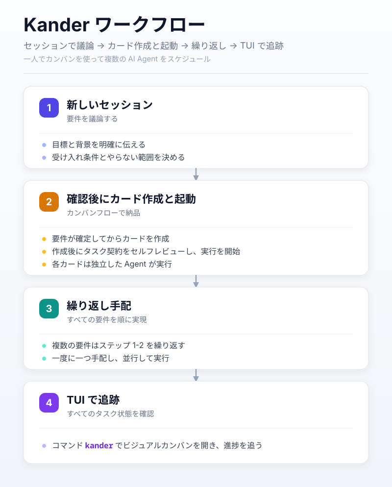

# Kander

[English](README.md) | [简体中文](README-CN.md) | **日本語**

[](https://github.com/dualface/kander)

厳格なルール駆動型マルチ Agent 並行開発。独立レビューと品質ゲートを標準装備し、自動化された納品品質を徹底担保。

> **実際のエンジニアリングから誕生**  
> 2026 年 8 月以来、Kander は 4 つのプロジェクトで 1,500 件を超える実タスクを完了してきました。そのうち 1,315 件は [QuickTUI](https://quicktui.ai/) の本番環境です。実際のコード競合、並行性競合、複雑な不具合の対応を通じて継続的に洗練され、真に信頼できる Agent スケジューリング、独立レビュー、クラッシュリカバリ機構を確立。より安価なモデルを使用した場合でも、納品品質を保証します。
>
> | 1 人 + 6 つの Agent | 68 日 | 4 プロジェクト |
> | --- | --- | --- |
> | 完了カード **1,544** 枚 | 独立レビュー **1,484** 回 | レビューバッチの **50%** がブロック |
>
> 数値と定義：[Kander 実運用データ](docs/production-stats-ja.md)（2026-10-07 時点）
>
> 詳細レポート：[Kander 本番運用の振り返り](docs/KANDER_PRODUCTION_RETROSPECTIVE.md) ｜ [本番運用詳細レポート（英語深度分析）](docs/KANDER_PRODUCTION_RETROSPECTIVE_FULL_EN.md)



### 主な機能

- **2 段階の独立レビューゲート**：実装とレビューを物理分離。PMQA が潜在的な仕様不整合やステートマシン欠陥を検知し、誤ったテスト通過（false-green）を阻止。
- **コンフリクト検知スケジューリング**：Git ブランチの重複や変更ファイル境界を静的解析し、書き込み衝突のない安全な並行実行を実現。
- **端末とワークスペースの完全分離**：Git Worktree と tmux/herdr コンテナを活用し、複数 Agent の完全並行実行を分離。
- **設定不要の GitHub 連携**：ローカルの `gh` 認証情報をそのまま利用。ボード内から Issue 閲覧、タスクカードへのワンクリック取り込み、進捗同期が可能。

## 1. クイックスタート

実行には Git と、Codex、Claude、Grok、Cursor、Pi のうち少なくとも 1 つが必要です。

**macOS** — Homebrew でインストールします：

```sh
brew install dualface/tap/kander

kander
```

**Linux** — バイナリを直接ダウンロードします：

```sh
ARCH=$(uname -m); [ "$ARCH" = x86_64 ] && ARCH=amd64; [ "$ARCH" = aarch64 ] && ARCH=arm64
curl -fsSL "https://github.com/dualface/kander/releases/latest/download/kander-linux-${ARCH}.tar.gz" | tar xz

./kander
```

**Windows** — [Releases](https://github.com/dualface/kander/releases) から `kander-windows-amd64.zip` をダウンロードし、展開して `kander.exe` を実行してください。

初回起動時にまだインストールされていなければ対話ウィザードが始まります。インストールが完了すればすぐに使えます。

4 ステップで始められます:

1. Agent セッションを新規に開き、そこで要件やタスクを議論し、目標と受け入れ条件を明確にします。Agent の Plan モードの利用を推奨します。
2. タスクが確定すると、Agent（Kander ルール導入後）がカンバンフローでタスクを起動するか確認します。承認するとタスクが自動作成・起動されます。
3. 要件が複数ある場合は、要件ごとにステップ 1-2 を繰り返し、継続的にタスクを手配・起動します。
4. コマンドラインインターフェースでタスクの状態を確認します:

```sh
kander
```


> 上図のカンバンの内容は私の実プロジェクト [https://quicktui.ai](https://quicktui.ai/) のものです。QuickTUI はコンピュータ上のさまざまな Agent をリモート操作するツールで、iOS/Android/macOS/Linux/Windows に対応し、無料で使えます。

### ターミナルカンバンのショートカット

| キー              | 説明                                                     |
| ----------------- | -------------------------------------------------------- |
| `Space` / `Enter` | タスク詳細の表示（Vim スタイルの移動に対応）             |
| `m`               | タスク操作メニュー（開始、移動、アーカイブ）             |
| `g`               | GitHub Issues オーバーレイ（閲覧・ワンクリック取り込み） |
| `c`               | 独立した Chat セッション起動（タスク化前の簡易相談）     |
| `y`               | 選択中カードのタスク ID をコピー                         |
| `/`               | タスクカードのフィルタ・検索                             |
| `r`               | カンバンデータの最新化                                   |

さらに詳しく: [タスクを効率的に進める方法](docs/how-to-advance-tasks-efficiently-ja.md) ([PDF スライド](docs/how-to-advance-tasks-efficiently-ja.pdf)) を参照してください。

## 2. 主なコマンド

- `kander`：対話型ターミナルカンバンを開く。
- `kander doctor`：環境依存、Agent の利用可否、ランチャー、ルール設定の診断と修復。

## 3. GitHub 連携

プロジェクトを GitHub リポジトリに紐づけるには [GitHub CLI](https://cli.github.com/)（`gh`）が必要です。Kander はトークンを要求・読み取り・保存せず、`gh` が管理する認証情報をそのまま利用します。

端末ボードで `g` を押すと、GitHub Issue の一覧がオーバーレイで開きます。

## 4. よくある質問 (FAQ)

#### Q: タスクカードを別の Agent に引き継ぐにはどうすればよいですか？

**A:** 現在そのタスクカードを処理している Agent を停止し、新しい Agent を起動して「タスクカード `TASK-ID` を引き継いで進めてください」と指示します（`TASK-ID` を実際のタスク ID に置き換えてください）。ターミナルカンバンでカードを選択して `y` キーを押すと、タスク ID をコピーできます。

#### Q: Agent にタスクグループ全体を引き継がせるにはどうすればよいですか？

**A:** タスクカード ID をコピーし、Agent を起動して「タスクカード `TASK-ID` が属するタスクグループの進行役（主控）として引き継ぎ、進めてください」と指示します。

#### Q: 未完了タスクの進捗状況を確認するにはどうすればよいですか？

**A:** Kander ルールを読み込んだ Agent を起動し、「未完了のタスクカードの現在の状態はどうなっていますか？」と直接尋ねてください。

## 5. ste-zh でタスク報告をわかりやすく

Agent の報告を中国語で読む場合は、Kander と [ste-zh](https://github.com/dualface/ste-zh) の併用をおすすめします。ste-zh は、Agent に ASD-STE100（簡略化技術英語）の原則で、中国語で結果を報告させる Agent skill です。

作者の日常の Kander ワークフローでは、この組み合わせが非常にうまく機能しています。Kander の完了報告はもともと実際の検証結果の記録を求めます。ste-zh はすべての返答を読みやすくします：

- 最初に結論を書く；
- 状態語を固定する（例：「已完成」「未验证」「阻塞」）；
- 各結論について、検証したかどうかと検証方法を書く；
- 判断が必要なときは、番号付きの選択肢を示す。

多数のカードを並行実行していても、各報告を数秒で読み、完了したもの、未検証のもの、判断待ちのものがわかります。

Claude Code へのインストール（ディレクトリ名は `ste` である必要があります）。セッションで `/ste` と入力して有効にするか、グローバルルールに書いて毎セッション有効にします：

```bash
git clone https://github.com/dualface/ste-zh.git ~/.claude/skills/ste
```

## 6. 応用ドキュメント

- [レビュー機構と完了ゲート](docs/review-disposition-ja.md)
- [カードトランザクションと障害復旧](docs/card-transactions-ja.md)
- [ターミナルバックエンドとコンテナ定義](docs/terminal-backend-ja.md)
- [タスク永続化ディスパッチプロトコル](docs/durable-dispatch-ja.md)
- [GitHub Issue 取り込みと結果プロトコル](docs/github-issue-import-ja.md)

## 7. ライセンス

本プロジェクトは MIT License を使用しています。[LICENSE](LICENSE) を参照してください。

## 8. 変更履歴

リリースノートは [CHANGELOG.md](CHANGELOG.md) を参照してください。

## 9. 作者のその他のプロジェクト

Kander の作者 [dualface](https://github.com/dualface) によるその他のプロジェクト：

- [ste-zh](https://github.com/dualface/ste-zh)：ASD-STE100 の原則で Agent に中国語で結果を報告させる skill。結論ファースト、固定の状態語、検証状態の明記。
- [Ullage](https://github.com/dualface/ullage-cli)：Claude、ChatGPT、Grok、Cursor などのサブスクリプション使用量を確認するローカルデーモン + CLI。
- [QuickTUI](https://quicktui.ai/)：あらゆるコーディング Agent のための、スマホ上の完全なターミナル。セルフホストで直接接続。1 台のホストまで無料。
