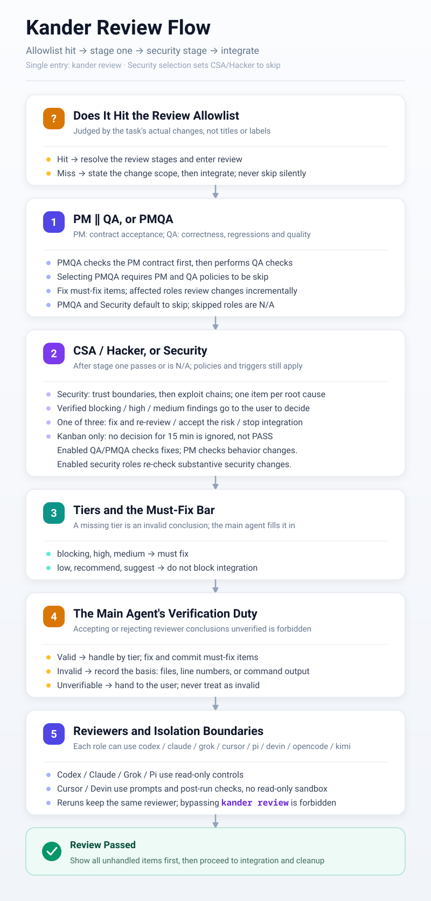

# Kander

**English** | [简体中文](README-CN.md) | [日本語](README-JA.md)

One person schedules multiple AI agents with a kanban board.


## 1. Getting Started

Ready to use right after installation.

Four steps to get going:

1. Start an agent session and discuss the requirement or task there, making the goal and acceptance criteria clear. The agent's Plan mode is recommended.
2. Once the task is confirmed, ask the agent in that session to complete it through the kanban flow:

```text
Create a card with kander new, then launch it with kander start
```

3. When you have multiple requirements, repeat steps 1-2 for each one, continuously scheduling and launching tasks.
4. Check task status with the command-line interface:

```sh
kander
```

For a deeper walkthrough, see the slides: [How to Advance Tasks Efficiently](docs/how-to-advance-tasks-efficiently-en.pdf) (PDF).

## 2. Installation

Requires Go 1.25+, Git, and at least one of Codex, Claude, Grok, or Cursor.

Get the kander binary and run it directly. On first launch, if not yet installed, an interactive wizard starts: choose the interface language (`cn`/`en`/`ja`) and the install location, then it extracts the rules and copies itself to the destination. There is only one English copy of the rules; the language the agent uses to talk to you is decided by the `agent_language` setting, which can be changed in the options panel that opens afterwards. When a card is created, this value is written into the card's `LANGUAGE` field, and that card keeps using it from then on. The environment check and the options panel follow automatically. Installed users can rerun the wizard with `kander install` (to upgrade rules or change the install location). Commands can also switch to the Japanese interface directly with `--lang ja`.

Install from source with Go:

```sh
go install github.com/dualface/kander/cmd/kander@latest
```

Or build at the repository root and run:

```sh
make
./kander
```

Windows (no make required):

```powershell
.\make-windows.cmd
.\kander.exe
```

Kander has two install scopes, sharing the same rules and program.

During installation, `kander doctor` repairs, and options-panel saves, the rules entry is automatically wired into the agent's rules file: for Claude, an `@` reference line is appended to `CLAUDE.md` (`~/.claude/CLAUDE.md` for global installs, the repository root for project installs); for other agents, an instruction to read `KANDER-AGENTS.md` is appended to the corresponding `AGENTS.md` (under `~/.codex/`, `~/.cursor/`, `~/.grok/` for global installs, the repository root for project installs). If a reference already exists in any form (including symlinks or the full text merged in), nothing is appended again; a global install only touches agents whose config directories already exist, and it only ever appends, never overwriting existing content.

### 2.1 Global Install

Choose global in the wizard. The binary lands at `~/.local/bin/kander` (`kander.exe` on Windows) and the rules at `~/.agents/`. If the command is not available, first add `.local/bin` under your home directory to PATH.

### 2.2 Project-Local Install

Choose project in the wizard and provide the Git repository directory. The installation lives in `.kander/` in the repository's main worktree; all worktrees share this installation, and `/.kander/` is idempotently appended to `.git/info/exclude`. Open the kanban with the absolute command path printed by the wizard; the `kander` commands below also use this entry. Project configuration is independent from global configuration, and entering a project directory does not automatically switch the command on PATH.

Directory-card migration also fills in SIZE and adjusts the relative link paths needed to keep targets valid; the whole mapping batch is persisted with the transaction and supports recovery after interruption. For the syntax scope, the maintenance window, and how unsupported syntax is handled, see [Directory cards](docs/directory-cards.md).

## 3. Common Commands

Run `kander` directly to check task status in the command-line interface. It supports multi-column browsing, search, task details, mouse operation, and clipboard copy; card bodies are rendered as Markdown.


> The board contents above come from my real project [https://quicktui.ai](https://quicktui.ai). QuickTUI is a tool for remotely operating the agents on your computer; it supports iOS/Android/macOS/Linux/Windows and is free to use.

Common keys: arrow keys or `hjkl` to move, `Enter` to view a card, `/` to search, `y` to copy the task ID, `s` to launch the selected backlog/todo task after confirmation, `g` to jump to the selected task's agent window (herdr/tmux; tmux requires being inside a client), `-`/`=` to change the number of on-screen columns, `a` to toggle the archive column, `t` to switch themes, `o` to open options, `r` to refresh, `q` to quit. Press `?` for the full key reference.

Pressing `s` in the list immediately shows a loading dialog; only the selected card is read in the background, then the agent resolved by SIZE and the actual launcher are filled in. Confirmation is disabled while loading; the wheel can scroll the board (changing the selection closes the old dialog); once loading finishes, `y` confirms and any other key cancels. Backlog cards first move to todo through the existing gate. herdr/tmux/tmux-session launch in the background, refreshing the board and showing the container address on success; foreground/console prompt you to use the terminal command `kander start <task-id>` instead. Failures show the reason and keep the existing launch rollback semantics. After confirmation, the dialog stays and shows that launching is in progress; keypresses during launch neither close it nor launch twice. Success, failure, and warnings update in place, terminal states close on any key, and overflowing content can be scrolled inside the box with the wheel. On narrow screens the agent, launcher, and full address take priority; when they still do not fit, a temporary wrapped overlay shows the full result. `s` inside the detail view or the search input does not trigger a launch.

The remaining commands are mainly for agents: `kander new`/`pick`/`start`/`resume` create cards and launch them, `kander notify`/`dispatch`/`dismiss` deliver messages, read durable receipts, and dismiss sessions, `kander check` checks board entries and task contracts, `kander review` runs one review, `kander config`/`doctor` view and repair configuration, `kander install` reruns the install wizard, `kander version` shows the version.

All new cards use `<task-id>/spec.md`; `SIZE: small|large` decides the scale, and the config keys are unchanged. The default small keeps IMPLEMENTATION/SUMMARY; `new --large` uses large's report.md completion requirements. Old files are read-only compatible and must be migrated before changes.

`kander init` explicitly migrates seven-state legacy cards and recovers unfinished transactions. First pause agents, external editors, notifications, and archive writes; while working/review cards exist, migration is refused by default, and once all writes are stopped, confirm the maintenance window with `kander init --maintenance`. Agents are not stopped automatically. A second run migrates 0 cards, leaving card contents and mtimes unchanged. See [Directory cards and migration](docs/directory-cards.md).

`kander show --json <task-id>` returns the body, current position, revision, and operation ID. The agent writes the revised draft to a separate UTF-8 file, then submits it with `kander update <task-id> --document spec.md --file <input> --expect-revision <revision>`; small cards also use the logical document name `spec.md`. On conflict, re-read and merge. Complete with `move <task-id> done --result completed`; claim manually with `move <task-id> working --owner <agent>`. See [Card transactions](docs/card-transactions.md) for the protocol and recovery; [guard-write](docs/kanban-write-guard.md) is only an auxiliary check and does not guarantee atomicity between the check and external writes.

Task-group review dispatch-back uses durable dispatch; ordinary working messages can pick a kind explicitly with `--kind fix|sync|wrap-up`. A stable ID is printed before sending; retries carry `--dispatch-id`; only controlled moves from the executor carrying the ID/epoch generate acceptance/completion receipts. Terminal echo does not mean work has started, and unknown does not auto-launch a second executor. For commands, deadlines, compatibility, and recovery, see [Durable dispatch protocol](docs/durable-dispatch.md).

`kander coordinator show/claim/reconcile` saves orchestration checkpoints via CAS and coordinator epochs. The initial snapshot and subsequent events likewise consume durable dispatches, original review artifacts, and actual Git evidence; a restart does not need to re-observe the working edge, nor does it auto-notify or integrate. See [Orchestration checkpoints and recovery](docs/coordinator-recovery.md).

The liveness section of `kander check` and `subscribe` heartbeats only report observations. `alive` means the agent exists, not that it is ready or that the task is progressing; `notify` still independently checks whether messages can be received. After the old address becomes invalid, `stopped` is reported only when a valid reverse lookup confirms zero matches; a unique match reports `drifted`; a failed reverse lookup, invalid output, timeout, or multiple matches report `unknown`, preserving the original address-failure reason plus the reverse-lookup stage and reason. With reverse lookup disabled or an empty session reference, the original direct-probe semantics are kept; Codex empty references are not reverse-looked-up. Liveness probing does not write cards, nor does it change `check`'s structural-check exit code.

Single-card liveness probing's forward query, session reverse lookup, re-check, and process reaping share a 10-second default deadline; the context API uses the caller's deadline and cancellation signal. Once the budget is exhausted, no further queries start and the result is `unknown`. On cancellation, output pipes are closed and owned processes reaped; for platform boundaries and verification scope, see [Probe deadlines and cancellation](docs/probe-deadlines.md).

`check`'s multi-card liveness collection shares a 10-second total budget, probing at most 4 cards concurrently; uncollected entries keep an `unknown` reason, and the output includes the observation time, validity, and independent running state. Batch API results are bound to task/session identity; `alive` does not mean ready or business progress; subscription scheduling still follows the existing single-card collection rules.

## 4. Workflow

Every task follows the flow below. Kander's development rules are enabled per module, all on by default for new installs; turning a module off lets a single card follow your existing Git, review, and delivery flow.

### 4.1 Card Creation and Self-Review

After creating a card, the agent must self-review the task contract, leaving a `SELF_REVIEW:` conclusion line in `DISCUSSION`. Tasks with SIZE large and task-group member cards also need a card review by an independent agent that does not share the creation context, leaving a `CARD_REVIEW:` line.

Before a card enters the pending column, a machine gate runs: required sections complete, no leftover `<FILL_IN>` placeholders, at least one decidable `- [ ]` acceptance item, and the record lines above present. The tool only verifies that the records exist; the quality of the conclusions remains the card creator's responsibility.

### 4.2 Task Splitting

With "task-group orchestration" enabled, the agent splits a task into cards that are as independent as possible, based on its complexity and splittability. Each card corresponds to one or more Markdown files.

If a task is split into multiple cards, they are treated as a task-card group. With the module off, only single cards run and grouping is not forced.

### 4.3 A Single Card Completed Independently

For a single card, an independent agent is launched to complete the task. This agent is called the task agent.

The task agent's steps:

- Create a git worktree to avoid interfering with other agents' work.
- Produce code or documents.
- Launch an independent review agent to review the result.
- After the review passes, integrate the task branch into develop as authorized, sync locally, and clean up the task worktree and branch.
- Output a task summary and finish.

With "Git flow" off, worktrees, develop, auto-commit, and merge-back are not required; with "review flow" off, reviews are not started automatically.

### 4.4 A Task-Card Group of Multiple Cards

The agent that launches a task-card group becomes the coordinator agent, responsible for orchestrating tasks and reviews. "Task-group orchestration" requires "Git flow" to be enabled as well.

The coordinator ensures all cards complete in the correct order according to their dependencies. Where possible, it also launches multiple cards at once for efficiency.

Unlike the single-card flow, each task agent is now only responsible for producing code or documents; after finishing, it moves the card into the review column to await the coordinator's acceptance of the delivery.

- The coordinator accepts and reviews in batches by module, milestone, or dependency chain, without waiting for the whole group to finish; deliveries outside the batch queue until the review batch completes.
- After receiving review results, the coordinator consolidates them and sends fix feedback back to the corresponding task agents via `kander notify`, then performs an incremental re-review after receiving the fixed delivery.
- The whole process repeats until the entire group is complete, then it is finally integrated into develop as authorized.
- The coordinator dispatches the original task agents to clean up task branches and worktrees, complete the records, and move cards into done, then schedules successor groups.
- Output a task summary, ask the user whether to dismiss the task agents, and finish.

### 4.5 Review

Kander defines four review roles, each with a different focus:

- PM: the product manager only cares whether the implementation meets the goal, and does not casually expand the scope.
- QA: cares whether the implementation fits the project's overall architecture, plus code quality and maintainability.
- CSA: cares about intrinsic code security.
- Hacker: adversarially reviews from the outside for attack weaknesses.

PM and QA run the first round in parallel on the same commit; only after both pass do CSA and Hacker enter the second stage. Each role can be configured as auto, skip, or required; for most tasks, having PM and QA run is enough.



Reviews support repeated `--task` to bind cards, saving the original reports, inputs, run facts, and manifest to `reviews/<run_id>/`, leaving only a machine index in the body. Retrying the same run ID only recovers or completes publication without rerunning reviewers; execution success and semantic PASS are independent. For invocation, batch CAS, and recovery, see [Review evidence archive](docs/review-evidence.md).

Even with the "review flow" module off, `kander review` can still be invoked explicitly for a single review, without requiring Kander's branch model.

## 5. Configuration

Press `o` on the board to open the options panel and change configuration at any time:

- Interface: color theme, max columns on screen, min column width, auto-refresh interval, show only the current column, show all columns, default language, agent communication language
- Task execution and models: the agents and launchers used for large and small tasks, plus those agents' models and reasoning effort
- Review and models: each of the four review roles' reviewer and stage policy, plus each one's model and reasoning effort
- Rule modules: communication and collaboration, code quality, Git flow, review flow, task-card intake, task-group orchestration, completion report format
- Flow chart: concisely lists the execution agent/model for large and small tasks, plus the enabled review stages and each role's agent/model; reads the current session (including unsaved changes), distinguishes always-run from conditional reviews, supports scrolling and Esc to return, and does not modify configuration
- Environment check: run `kander doctor` in place to check and repair configuration

Interface preferences take effect immediately on selection; the other pages write the config file on `Enter`. The options panel needs an interactive terminal; you can also view configuration with `kander config`, and check and repair it with `kander doctor`.

Configuration is saved in the current install scope's `config.json`; global and project installs each keep their own without inheriting from each other. Agents read configuration from the current scope's `KANDER-AGENTS.md` entry, then read enabled rule modules as needed.

## 6. License

This project is under the MIT License; see [LICENSE](LICENSE).

For post-archive plans, original-author disposition, batch summaries, and completion gates, see [Review disposition protocol](docs/review-disposition.md).

### Custom Execution Agents

You can override executable names and pane process names in the `agents` section of `config.json`, or declare new agents with dialects, argv templates, and session policies; the options panel can select them and edit their program names. [Full configuration and boundaries](docs/custom-agents.md). Reviews continue to use `*_REVIEW_BIN` independently.
