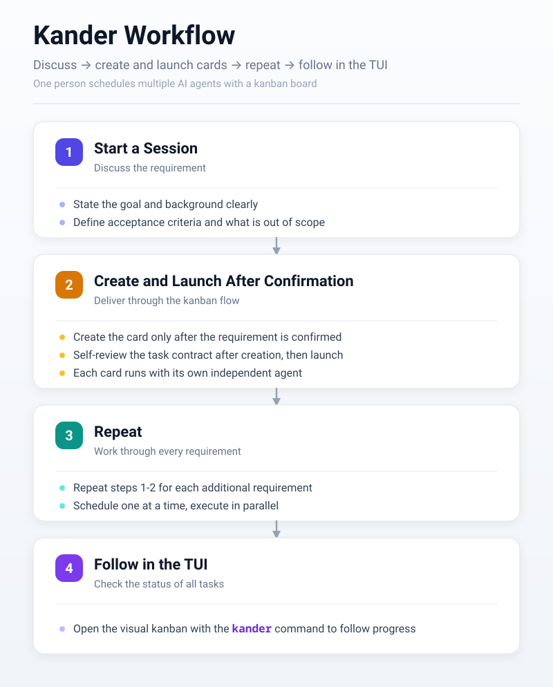
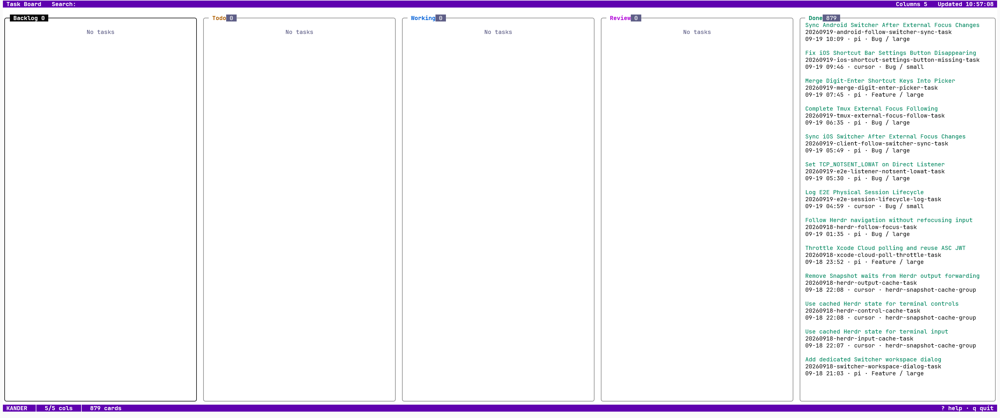

# Kander

**English** | [简体中文](README-CN.md) | [日本語](README-JA.md)

One person schedules multiple AI agents with a kanban board.



## 1. Quick Start

Running requires Git, plus at least one of Codex, Claude, Grok, or Cursor.

Download the latest kander binary from [Releases](https://github.com/dualface/kander/releases) and run it directly. On first launch, if not yet installed, an interactive wizard starts.

Once installation finishes, it is ready to use.

Four steps to get going:

1. Start an agent session and discuss the requirement or task there, making the goal and acceptance criteria clear. The agent's Plan mode is recommended.
2. Once the task is confirmed, the agent asks whether to launch it through the kanban flow. Confirm, and the task launches automatically.
3. When you have multiple requirements, repeat steps 1-2 for each one, continuously scheduling and launching tasks.
4. Check task status with the command-line interface:

```sh
kander
```



> The board contents above come from my real project [https://quicktui.ai](https://quicktui.ai). QuickTUI is a tool for remotely operating the agents on your computer; it supports iOS/Android/macOS/Linux/Windows and is free to use.

Further reading: the slides [How to Advance Tasks Efficiently](docs/how-to-advance-tasks-efficiently-en.pdf) (PDF).

## 2. License

This project is under the MIT License; see [LICENSE](LICENSE).
