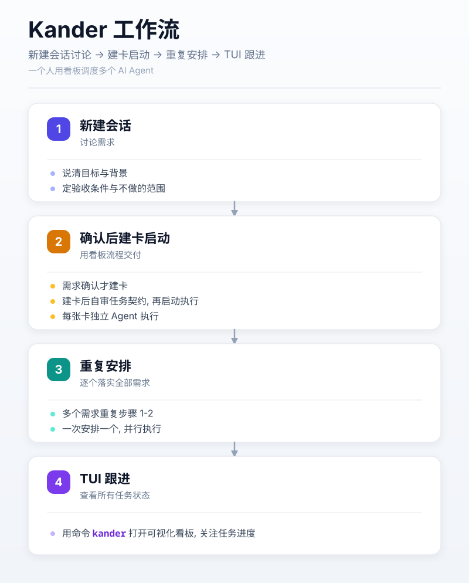
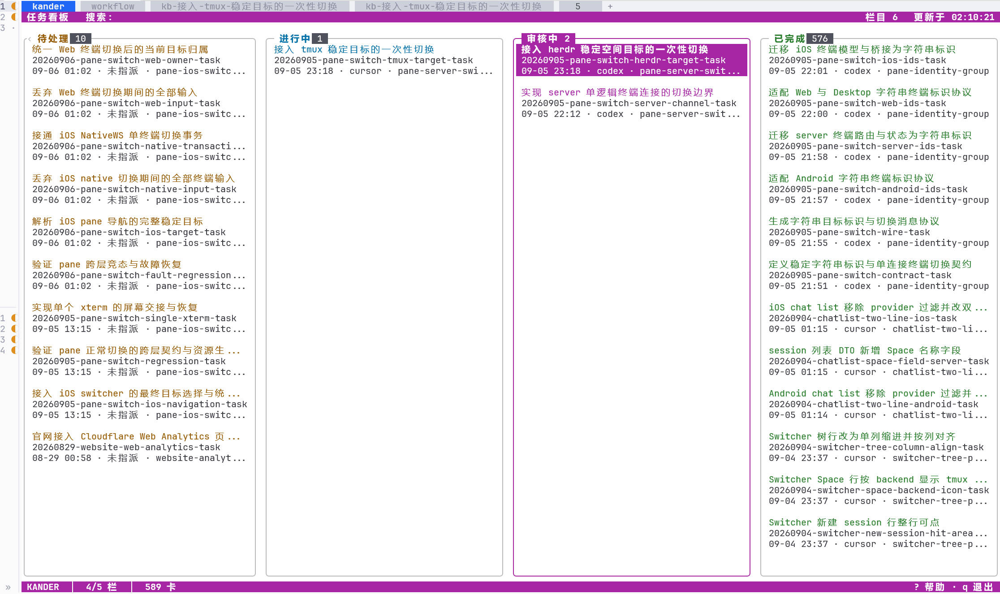

# Kander

一个人用看板调度多个 AI Agent.



上图展示完整工作流. Kander 的开发规则可以按模块启用, 新安装默认启用全部七个规则模块; 也可关闭对应模块, 让单卡沿用你已有的 Git、审核和交付流程.

## 1. 新手指引

安装完成后即可使用.

4 步上手:

1. 新建一个 Agent 会话, 在里面讨论需求或者任务, 说清楚目标和验收条件. 推荐使用 Agent 的 Plan 模式.
2. 任务确认后, 在该会话里要求 Agent 用看板流程完成任务:

```text
用 kander new 创建任务卡, 完善任务契约并按看板规则完成建卡后自审, 再用 kander start <task-id> 启动
```

3. 有多个需求时, 对每个需求重复步骤 1-2, 不断安排并启动任务.
4. 用命令行界面查看任务状态:

```sh
kander
```

## 2. 安装

需要 Go 1.25+, Git, 以及 Codex, Claude, Grok 或 Cursor 中至少一个.

Kander 有两种安装作用域, 共用同一套规则和程序.

### 2.1 全局安装

macOS/Linux:

```sh
./install.sh
```

Windows (PowerShell):

```powershell
.\install.ps1
```

安装完成后退出安装器. 在项目目录运行 `kander` 打开终端看板, 按 `o` 配置 Agent、模型和规则开关. 命令不可用时, 先将用户主目录下的 `.local/bin` 加入 PATH.

### 2.2 项目本地安装

macOS/Linux:

```sh
./install.sh --project <项目目录>
```

Windows (PowerShell):

```powershell
.\install.ps1 --project <项目目录>
```

项目安装位于该 Git 仓库主 worktree 的 `.kander/`, 全部 worktree 共用这份安装. 使用安装器输出的绝对命令路径打开看板, 按 `o` 配置; 后文的 `kander` 命令也应使用这个入口. 项目配置独立于全局配置, 进入项目目录不会自动切换 PATH 中的命令.

## 3. 常用命令

直接运行 `kander` 打开终端看板. 程序启动即进入 alt-screen, 退出后终端恢复原样.

支持多栏浏览、搜索、任务详情、鼠标操作与剪贴板复制; 任务卡正文按 Markdown 渲染.

运行 `kander version` 查看由 UTC 构建时间戳和 Git hash 组成的版本号; 选项面板标题右侧也会显示该版本号.

`kander show <task-id>` 在卡片正文前输出当前状态与绝对路径, 供 Agent 写卡前重新定位; `kander guard-write <path>` 供宿主项目的写入前 hook 拦截「旧路径复活卡片」的误写, 接入方式见 [docs/kanban-write-guard.md](docs/kanban-write-guard.md).

常用按键: 方向键或 `hjkl` 移动, `Enter` 看任务卡, `/` 搜索, `y` 复制任务 ID, `-`/`=` 增减同屏栏目数, `a` 切换存档栏目, `t` 换主题, `o` 打开选项, `r` 刷新, `q` 退出. 按 `?` 随时调出完整按键说明.



## 4. 工作流程

下面介绍启用相应模块后的流程. 在选项面板的「规则模块」中按需选择, 或选择「完整流程」以采用完整工作流. 代码质量作为独立规则单独开启.

### 4.1 任务拆分

启用「任务组编排」后, Agent 会根据任务的复杂度和可拆分情况, 将任务拆分为尽可能独立的任务卡. 每个任务卡对应一个或多个 Markdown 文件. 关闭时可独立执行单卡, 不强制拆组.

如果一个任务拆分为多个任务卡, 则视为一个任务卡组.

### 4.2 单个任务卡独立完成

对于单个任务卡, 会启动一个独立的 Agent 完成任务. 这个 Agent 称为任务 Agent.

启用 Git 和审核模块时, 任务 Agent 的工作步骤:

- 创建一个 git worktree, 避免和其他 Agent 的工作互相干扰.
- 生成代码或文档.
- 启动独立的审核 Agent 对成果进行审核.
- 完成适用审核和验证后, 按已获授权将任务分支集成到 develop, 同步本地并清理任务 worktree 与分支.
- 输出任务总结, 结束.

Git 模块关闭时, 不要求 worktree、develop、自动提交、push 或合回; 审核模块关闭时, 不自动启动审核. 单卡满足任务契约及用户已有交付要求后仍可进入 done, 并保留真实的实施记录.

### 4.3 多个任务卡组成的任务卡组

「任务组编排」需要同时启用「Git 流程」. 启动任务卡组的 Agent 会转变为主控 Agent, 并负责编排任务和适用的审核流程. 关闭审核模块时跳过以下审核步骤, 验证完成后集成组分支.

主控 Agent 会根据任务卡的依赖关系, 确保所有任务卡按照正确的顺序完成. 在可能的情况下, 也会同时启动多个任务卡, 提高效率.

主控 Agent 先从 develop 创建组分支和组 worktree. 每个任务 Agent 使用独立的任务分支与 worktree, 负责实现、验证和提交, 再将任务卡移入 review 等待主控接收交付.

- 主控确认交付进入组分支且组 worktree 已同步后, 才放行依赖它的后继卡. 跨组依赖须等前置组完成集成与收尾, 并确认交付已在 develop 可用.
- 启用审核时, 主控按模块、里程碑或依赖链分批接收和审核, 每批覆盖对应的全部未审核交付. 审核批次完成前, 批外交付排队.
- 主控将审核意见通过 notify 派回原任务 Agent 核实和修复, 接收修复交付后进行适用复审.
- 每组全部交付和适用审核完成后, 按已获授权集成到 develop. 直接远端集成先普通 push 最终提交, 成功后再同步本地; 要求 PR 时遵从项目的 PR 门禁.
- 主控通过 notify 派原任务 Agent 清理任务分支和 worktree、补全记录并迁入 done. 全组收尾后清理组分支和组 worktree, 再继续调度后继组.
- 全部组完成后汇总结果, 询问用户是否通过 dismiss 遣散任务 Agent 并关闭对应终端容器; 未确认时保留会话.

### 4.4 审核

Kander 中定义了四种审核角色, 每个角色在审核时侧重点不同:

- PM: 产品经理只关注功能实现是否符合目标, 不会随意扩大功能范围.
- QA: 关注功能实现是否符合项目整体架构要求, 以及代码质量和可维护性.
- CSA: 关注代码内在安全性.
- Hacker: 用对抗性视角从外部审查是否存在攻击弱点.

用户可以配置四种审核角色是否启用. 自动审核还要求开启「审核流程」模块. 即使模块关闭, 仍可明确调用 `kander review` 运行单次审核, 不要求采用 Kander 的分支模型.

## 5. 配置

在看板里按 `o` 打开选项面板:

- 界面: 配色主题、同屏最大栏目数、栏目最小宽度、自动刷新间隔、只显示当前栏目、显示所有栏目、默认语言
- 任务执行与模型: 大任务与小任务分别使用的 Agent、启动方式, 以及这些 Agent 的模型与推理档位
- 审核与模型: 四个审核角色各自的 Reviewer、环节策略, 以及各自的模型与推理档位
- 规则模块:「基础流程」启用交流与协作、Git 流程、任务建卡引导、完成报告格式;「完整流程」另启用审核流程与任务组编排. 流程规则可逐项修改, 组合名自动匹配或显示「自定义」. 代码质量在「独立规则」中单独开关, 切换流程组合时保持原状态
- 环境检查: 就地运行 `kander doctor` 的检查与配置修复; 配置缺失时创建, 损坏 JSON 或无效字段按默认值修复, 保留合法设置, 覆盖已有配置前保存带时间戳的 `.bak` 原文备份. 不可用的 Agent/Reviewer 自动改选本机可用项, Reviewer 的模型随之更新; 没有替代项时报告问题. 无效 launcher 按平台和已安装工具改选, 有效选择保持不变. 配置齐备后标记初始化完成, 让修复后的选择立即生效. herdr/tmux 均不可用时推荐安装 herdr, 经确认运行对应平台的官方安装器; 跳过或安装失败仍继续检查与修复. 无交互终端时不安装软件, 但仍修复配置.

选 Agent 和配模型在同一屏: 模型与推理档位缩进显示在它所属的 Agent 下面, 改了 Agent 会立刻换成新 Agent 的; 启动方式排在最后.

界面偏好即选即生效并单独保存; 任务执行与模型、审核与模型、规则模块和界面里的默认语言在对应分页按 Enter 即写入配置文件; 规则接入检查仍可在根菜单选「保存并应用」完成.

项目模式检查主 worktree 根目录的 `CLAUDE.md` (Claude) 或 `AGENTS.md` (其他 Agent); 全局模式检查各 Agent 的用户全局规则文件. Claude 的相对导入路径按 `CLAUDE.md` 所在目录解析.

面板操作: `↑`/`↓` 移动, `←`/`→` 改值, `Enter` 进入分区或提交本节, `Esc` 返回上一层 (不会丢弃已改的值), `q` 或再按一次 `o` 关闭. 有未保存改动时关闭会先询问是保存还是放弃. 鼠标点击行可聚焦, 再点一次或双击即确认.

选项面板需要交互终端. 用当前作用域的 `kander config` 查看配置, 或用 `kander doctor` 检查并修复配置.

### 5.1 规则开关

配置仍保存在当前安装作用域的 `config.json`. 全局安装和项目安装各自保存选择, 不增加项目覆盖全局的继承层; `KANDER_CONFIG` 的现有路径覆盖方式保持可用. 新配置包含:

```json
{
  "rules": {
    "collaboration": true,
    "code": true,
    "git": true,
    "review": true,
    "task_intake": true,
    "task_groups": true,
    "reporting": true
  }
}
```

以上仅为配置中的规则段. 例如只开启 `code` 和 `review`, 就能使用 Kander 的代码规范和审核流程, 同时保留项目自己的 Git 约定. 关闭 `task_intake` 仍能主动建卡和启动单卡; 关闭 `reporting` 只取消固定汇报格式, 不取消卡片执行记录.

`task_groups=true` 必须同时有 `git=true`. 界面明确提示依赖, 无效组合不能保存; 任务组启动、恢复、接管和通知在修改卡片或启动 Agent 前再次检查. 单卡不受该依赖限制.

升级时, 合法旧配置没有整个 `rules` 段则沿用原七项全开, 后续保存或 doctor 规范化时写出明确值. 已有 `rules` 段内缺项默认关闭, 将来新增模块也默认关闭. 开关独立于初始化完成状态, 配置读取、运行时和 doctor 共用同一解析方式.

Agent 从当前作用域的 `KANDER-AGENTS.md` 入口读取 `kander config --json`, 再按需读取启用的 Markdown 模块. 分册原文全部安装, 不生成定制文件. 配置错误会明确报告, 不猜测为全部启用. 用户自己的全局和项目规则优先于 Kander 的可选约定, 命令本身的数据结构与安全校验仍然适用.

保存开关不自动重启 Agent 或改变正在执行的卡片. 后续启动、恢复、接管和通知会重新核对配置; 已有会话可能保留旧规则上下文, 建议新开会话. 安装和配置界面不覆盖你自己的 Agent 规则文件; 如果以前把整套旧规则复制进了自己的规则文件, 需要自行将旧副本改为引用当前入口, 才能避免旧要求继续生效.

## 6. 许可

本项目使用 MIT License, 见 [LICENSE](LICENSE).
