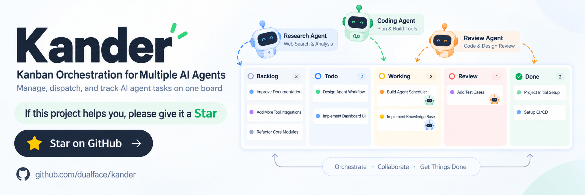
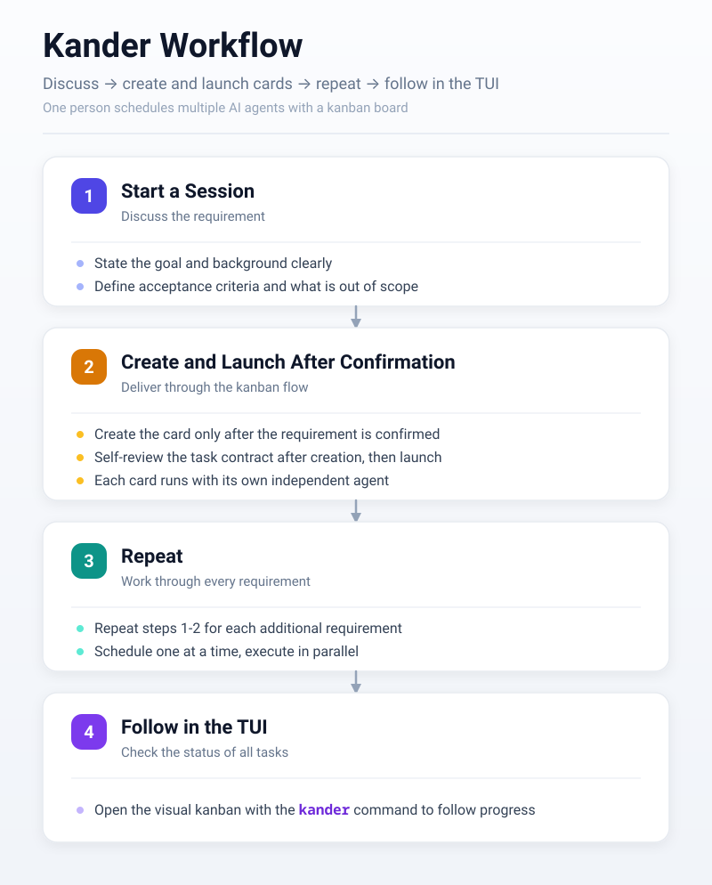
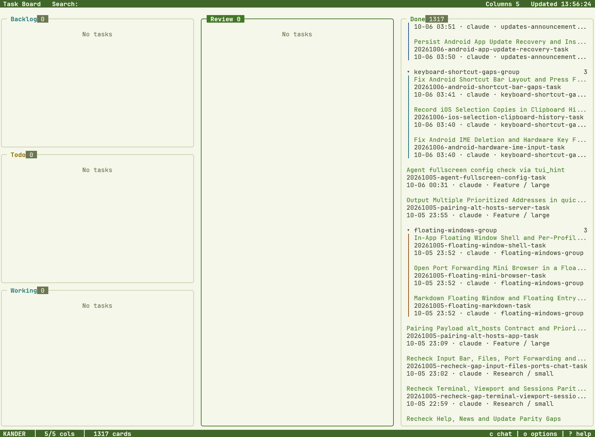

# Kander

**English** | [简体中文](README-CN.md) | [日本語](README-JA.md)

[](https://github.com/dualface/kander)

Strict rule-driven multi-agent parallel development with built-in independent review and delivery gates to ensure automated delivery quality.

> **Born from real engineering**  
> Since August 2026, Kander has driven more than 1,500 real tasks across 4 projects, 1,315 of them in the [QuickTUI](https://quicktui.ai/) production environment. Refined through handling actual code conflicts, race conditions, and complex bugs, it establishes truly reliable agent orchestration, independent review, and crash recovery. Even with lower-cost models, it guarantees delivery quality.
>
> | One developer + 6 agents | 68 days | 4 projects |
> | --- | --- | --- |
> | **1,544** task cards done | **1,484** independent review runs | **50%** of review batches blocked |
>
> Numbers and definitions: [Production Stats](docs/production-stats.md) (as of 2026-10-07)
>
> In-depth reading: [Kander in Production](docs/KANDER_PRODUCTION_RETROSPECTIVE.md) | [Full Production Retrospective](docs/KANDER_PRODUCTION_RETROSPECTIVE_FULL_EN.md) (Deep Dive)



### Key Features

- **Two-Stage Independent Review Gates**: Physical isolation between execution and review. PMQA catches semantic and state-machine bugs, blocking false-green tests.
- **Conflict-Aware Scheduling**: Static analysis of Git branch overlaps and file modification boundaries ensures controlled concurrency without write conflicts.
- **Terminal and Workspace Isolation**: Isolated parallel agent execution powered by Git Worktrees and tmux/herdr containers.
- **Zero-Token GitHub Integration**: Seamlessly reuses local `gh` credentials to browse issues, import task cards, and sync progress directly from the board.

## 1. Quick Start

Running requires Git, plus at least one of Codex, Claude, Grok, Cursor, or Pi.

**macOS** — install with Homebrew:

```sh
brew install dualface/tap/kander

kander
```

**Linux** — download the binary directly:

```sh
ARCH=$(uname -m); [ "$ARCH" = x86_64 ] && ARCH=amd64; [ "$ARCH" = aarch64 ] && ARCH=arm64
curl -fsSL "https://github.com/dualface/kander/releases/latest/download/kander-linux-${ARCH}.tar.gz" | tar xz

./kander
```

**Windows** — download `kander-windows-amd64.zip` from [Releases](https://github.com/dualface/kander/releases), unzip it, and run `kander.exe`.

On first launch, if not yet installed, an interactive wizard starts. Once installation finishes, it is ready to use.

Four steps to get going:

1. Start an agent session and discuss the requirement or task there, making the goal and acceptance criteria clear. The agent's Plan mode is recommended.
2. Once the task is confirmed, the agent (with Kander rules loaded) confirms whether to launch it through the kanban flow. Confirm, and the task is created and started automatically.
3. When you have multiple requirements, repeat steps 1-2 for each one, continuously scheduling and launching tasks.
4. Check task status with the command-line interface:

```sh
kander
```



> The board contents above come from my real project [https://quicktui.ai](https://quicktui.ai/). QuickTUI is a tool for remotely operating the agents on your computer; it supports iOS/Android/macOS/Linux/Windows and is free to use.

### Terminal Kanban Shortcuts

| Key               | Description                                                             |
| ----------------- | ----------------------------------------------------------------------- |
| `Space` / `Enter` | View task details with Vim-style navigation                             |
| `m`               | Task action menu (start, move, archive)                                 |
| `g`               | Open GitHub Issues overlay (browse and one-click import)                |
| `c`               | Open standalone Chat session (quick discussion without creating a card) |
| `y`               | Copy selected task ID to clipboard                                      |
| `/`               | Filter and search task cards                                            |
| `r`               | Refresh board data                                                      |

Further reading: [How to Advance Tasks Efficiently](docs/how-to-advance-tasks-efficiently-en.md) ([PDF slides](docs/how-to-advance-tasks-efficiently-en.pdf)).

## 2. Key Commands

- `kander`: Open the interactive terminal kanban board.
- `kander doctor`: Check and repair environment dependencies, agent availability, launchers, and rules configuration.

## 3. GitHub Integration

Linking a project to a GitHub repository needs the [GitHub CLI](https://cli.github.com/) (`gh`). Kander never asks for, reads, or stores a token; it reuses the credentials `gh` already manages.

On the terminal board, press `g` to open the GitHub issue list in an overlay.

## 4. Frequently Asked Questions (FAQ)

#### Q: How do I hand off a task card to a different Agent?

**A:** Stop the agent currently working on the card, launch a new agent, and prompt it to take over and continue task card `TASK-ID` (replace `TASK-ID` with the actual card ID). In the terminal kanban board, select the card and press `y` to copy its task ID.

#### Q: How do I instruct an Agent to take over an entire task group?

**A:** Copy the task card ID, launch an agent, and instruct it to act as the coordinator to take over and advance the task group containing `TASK-ID`.

#### Q: How do I check the progress and status of unfinished tasks?

**A:** Start an agent (with Kander rules loaded) and directly ask for the current status and progress of any unfinished task cards.

## 5. Clearer Task Reports with ste-zh

If you read agent reports in Chinese, pair Kander with [ste-zh](https://github.com/dualface/ste-zh). It is an agent skill that makes the agent report results by ASD-STE100 (Simplified Technical English) principles, in Chinese.

In the author's daily Kander workflow, this combination works very well. Kander's completion reports already require actual verification results; ste-zh makes every reply easy to scan:

- the conclusion comes first;
- status words are fixed, such as "completed", "not verified", and "blocked";
- every conclusion states whether it was verified, and how;
- when you must decide, the options are numbered.

When many cards run in parallel, you can read each report in seconds and know what is done, what is unverified, and what needs your decision.

Install it for Claude Code (the directory name must be `ste`), then type `/ste` in a session, or load it from your global agent rules so every session uses it:

```bash
git clone https://github.com/dualface/ste-zh.git ~/.claude/skills/ste
```

## 6. Advanced Documentation

- [Review Disposition & Completion Gate](docs/review-disposition.md)
- [Card Transactions & Crash Recovery](docs/card-transactions.md)
- [Terminal Backends & Container Definitions](docs/terminal-backend.md)
- [Durable Dispatch Protocol](docs/durable-dispatch.md)
- [GitHub Issue Import & Result Protocol](docs/github-issue-import.md)

## 7. License

This project is under the MIT License; see [LICENSE](LICENSE).

## 8. Changelog

Release notes live in [CHANGELOG.md](CHANGELOG.md).

## 9. More Projects by the Author

Other projects by [dualface](https://github.com/dualface), the author of Kander:

- [ste-zh](https://github.com/dualface/ste-zh): an agent skill that makes agents report results in Chinese by ASD-STE100 principles: conclusion first, fixed status words, explicit verification state.
- [Ullage](https://github.com/dualface/ullage-cli): a local daemon and CLI that shows subscription usage for Claude, ChatGPT, Grok, Cursor, and more.
- [QuickTUI](https://quicktui.ai/): a full terminal for any coding agent, on your phone. Self-hosted, direct connection. Free for a single host.
