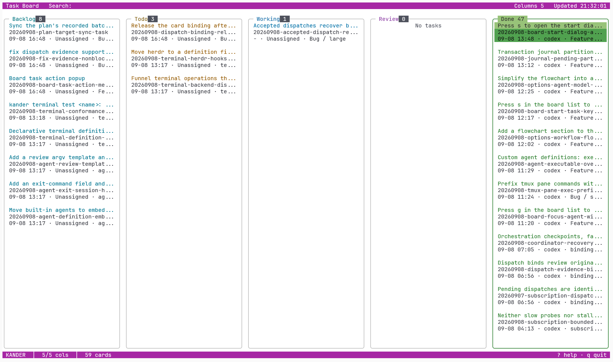
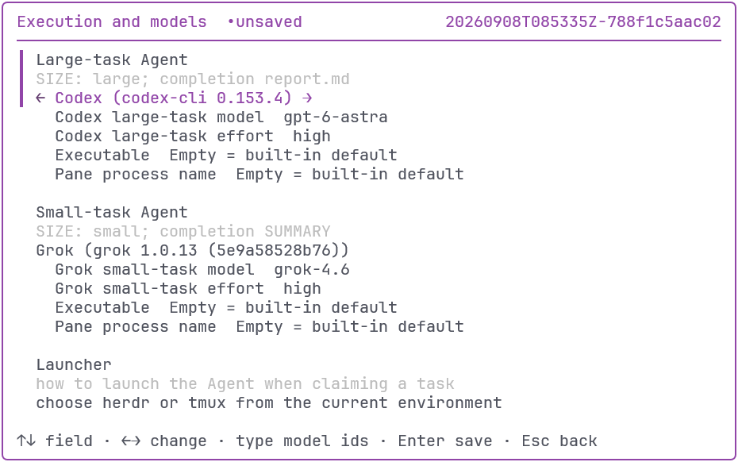
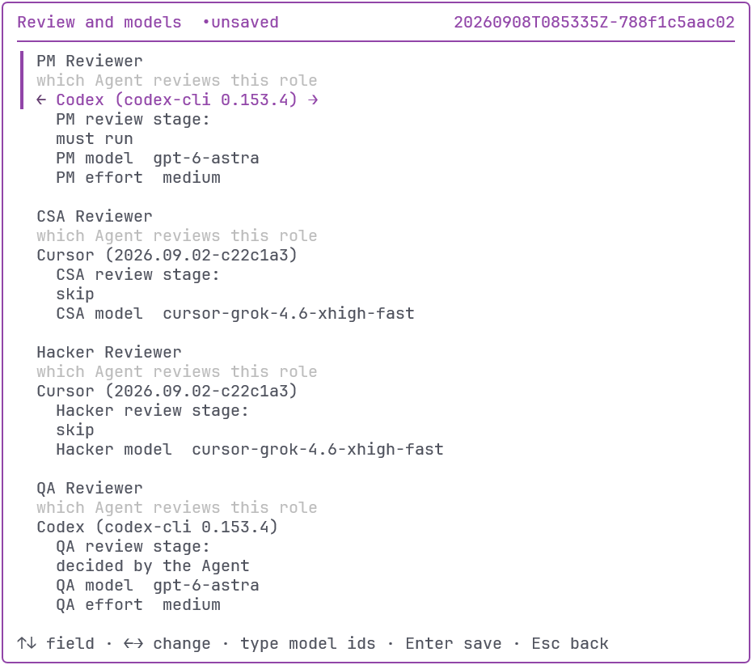
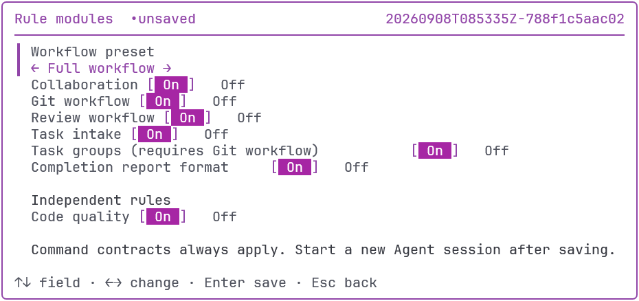

# 如何高效推进任务: 使用 kander

作者: [dualface](https://github.com/dualface)

[English](how-to-advance-tasks-efficiently-en.md) | [日本語](how-to-advance-tasks-efficiently-ja.md)

## kander 是什么?

- 使用 Markdown 定义的任务卡系统.
- 使用规则驱动的任务编排系统.
- 加上一个容易使用的 TUI 界面.

## 如何安装

1. 从 <https://github.com/dualface/kander> 下载最新版本.
2. 执行 `kander install`.
3. 在项目中执行 `kander init`, 创建 `./kanban/` 目录结构.

## 任务卡从何而来?

1. 用户和 Agent 讨论需求, 或者要求 Agent 查看 GitHub issue.
2. 用户和 Agent 交流, 确定要完成的任务.
3. 用户要求 Agent 创建任务卡.

## 任务卡里有什么?

- 任务卡根据任务复杂度, 由一个或多个 Markdown 文件构成.
- 所有任务卡保存在项目的 `./kanban/` 目录下.
- Markdown 包含完成任务需要的所有信息:
  - 任务描述
  - 任务清单
  - 验收清单

## 如何启动任务卡?

- Agent 通常会主动询问是否启动任务卡.
- 用户也可以明确告诉 Agent 启动任务卡.

## 任务卡如何执行?

- Agent 会根据规则, 使用 `kander start` 命令开启一个 Agent 来执行任务卡中描述的任务.
- 用户可以使用 `kander` 命令启动 TUI 界面, 查看所有任务的状态.

## TUI

## 调整执行任务的 Agent

- 为不同规模的任务指派不同的 Agent 和模型.
- 平衡质量和成本.

## 调整审核 Agent

- 为不同的审核角色指派不同的 Agent 和模型.
- 交叉审核能够获得更好的效果.

## 根据需要定制规则集

- 完整工作流可以获得最高的质量回报.
- 可以禁用不需要的规则集.

## 开源, 可审计, 可定制

- 充分审计规则定义.
- 自定义规则具有更高的优先级.
- 禁用 kander 的规则集, 用自己的规则集替代.

## 感谢

<https://github.com/dualface/kander>

请大家 Star ;-)
