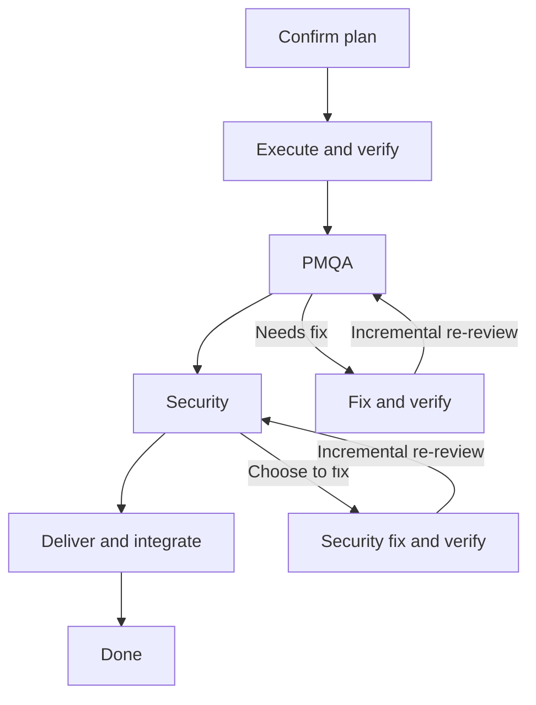

# Workflow chart

The options panel shows a compact preview of the configured main path for one task scale. `internal/flow` reads the in-memory options-session configuration; `internal/tui` renders the result without changing configuration or performing any workflow action.

## Main path

The main path means that the applicable release conditions have been satisfied. The chart omits a separate self-check node, review-trigger decisions, user-decision boxes, pause nodes, mechanical-fix exceptions, and integration rework. Those rules still apply; omission is not permission to bypass a gate. The Security repair loop returns only to Security and does not reopen PMQA, per `rules/KANDER-REVIEW-RULES.md` "Carrying Conclusions Forward".

## Configuration projection

- `rules.task_intake` controls the plan-confirmation node.
- `rules.git` controls the delivery-and-integration node. Completion remains visible when Git is disabled.
- `rules.review=false` hides all review stages and their loops and adds a note below the chart.
- A role with policy `skip` has no visible node or loop; the surrounding main-path nodes connect directly. `auto` remains visible as conditional because the options page has no concrete task to classify. `required` applies only when review is triggered, subject to higher-precedence instructions.
- Self-check, reporting details, collaboration rules, and task-group orchestration do not add nodes. The chart is a main-path overview, not a complete task-group state machine.

This preview does not infer natural-language project exceptions, user instructions, review-trigger facts, or live execution status. A repository-specific exemption still takes precedence during execution even when its configured role is visible here.

## Model and rendering

`Chart` carries the scale, execution node, review-disabled flag, plan-confirmation and integration flags, and ordered review stages. `Node` carries model and effort plus role and policy for review nodes. `Stage` keeps stable PMQA/Security positions in the model; empty stages are omitted by the renderer. As before, an unresolvable role policy contributes no node.

Execution and review models reuse the existing configuration resolution helpers, including per-scale overrides. Effort appears only for agents that support it; empty models use the localized CLI-default label. Each visible role has one box, with its model below its role and policy title.

Wide layouts draw a single repair box to the right of each review node. Its return rail is labeled as incremental re-review and returns to that same role. Narrow layouts wrap the branch labels below the node and explicitly name the return role. Skipped stages create no blank gaps, and every rendered line fits the panel's width. Full model values remain available in the model settings when the diagram clips a long value.

Labels use the English, Chinese, and Japanese flow catalogs. Task-scale switching, scope tabs, unsaved configuration previews, and keyboard/mouse scrolling remain available.
